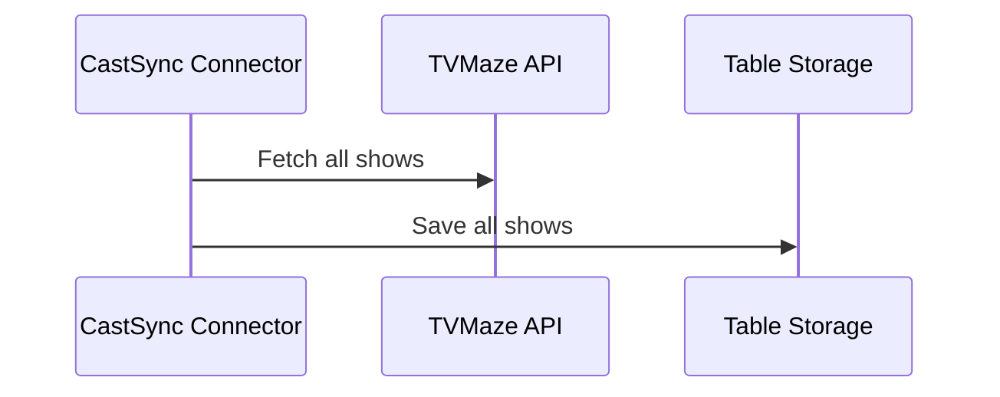
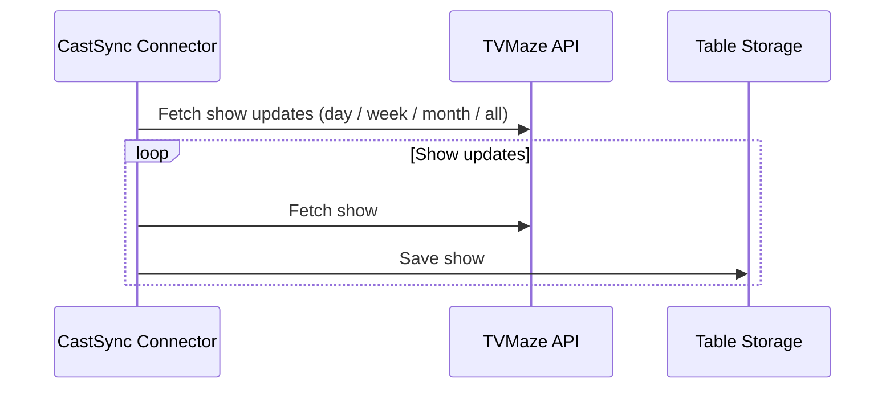
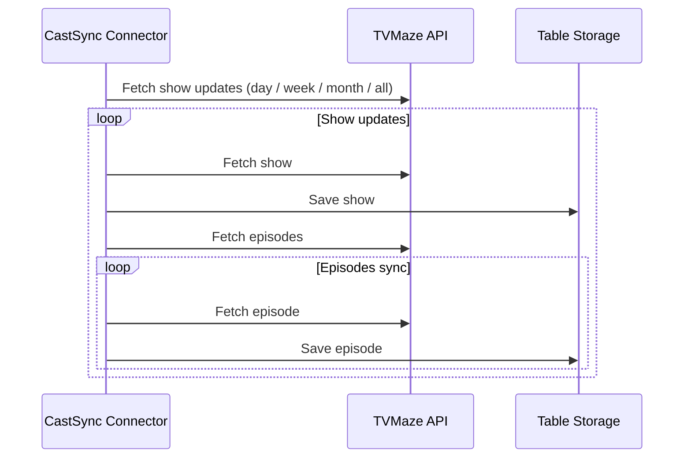

# serverless-constellation

## Initial Sync

```mermaid
sequenceDiagram
    CastSync Connector->>TVMaze API: Fetch all shows
    CastSync Connector->>Table Storage: Save all shows
```

## Updates Sync

```mermaid
sequenceDiagram
    CastSync Connector->>TVMaze API: Fetch show updates (day / week / month / all)
    loop Show updates
      CastSync Connector->>TVMaze API: Fetch show
      CastSync Connector->>Table Storage: Save show
    end
```

## Updates Sync TO-BE

```mermaid
sequenceDiagram
    CastSync Connector->>TVMaze API: Fetch show updates (day / week / month / all)
    loop Show updates
      CastSync Connector->>TVMaze API: Fetch show
      CastSync Connector->>Table Storage: Save show
      CastSync Connector->>TVMaze API: Fetch episodes
      loop Episodes sync
        CastSync Connector->>TVMaze API: Fetch episode
        CastSync Connector->>Table Storage: Save episode
      end
    end
```
